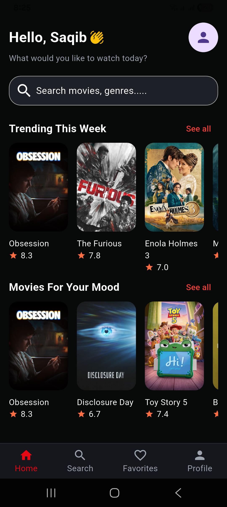
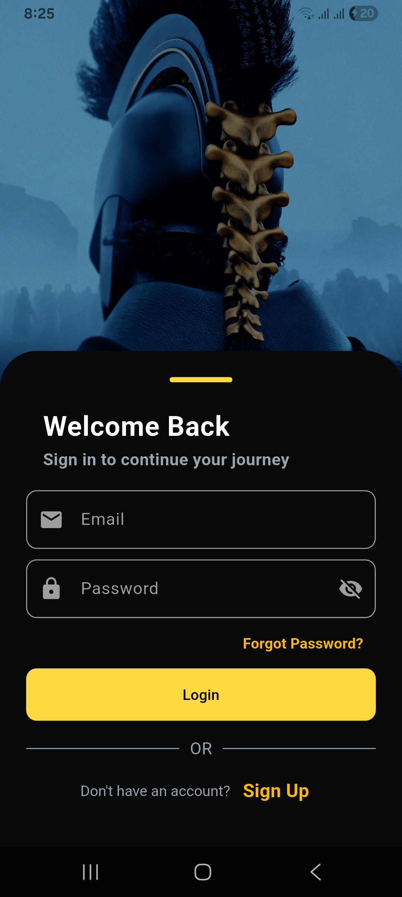

# 🎬 Movie Recommendation App

A modern **Movie Recommendation Application** built with **Flutter**, featuring **Firebase Authentication**, **TMDB API Integration**, **Provider State Management**, and a clean, responsive UI. The app allows users to browse popular movies, search for movies, view detailed information, manage favorites, and maintain their profile.

---

## ✨ Features

### 🔐 Authentication
- User Registration
- User Login
- Secure Logout
- Firebase Authentication

### 🎥 Movies
- Browse Popular Movies
- View Movie Details
- Movie Poster & Backdrop
- Movie Overview
- Release Date
- Ratings
- Runtime
- Genres
- Cast Information

### 🔍 Search
- Search Movies by Name
- Dynamic Search Results

### ❤️ Favorites
- Add Movies to Favorites
- Remove Movies from Favorites
- Persistent Favorites using Provider

### 👤 Profile
- Display User Information
- Profile Picture Support
- Logout

### 🎨 UI
- Modern & Responsive Design
- Bottom Navigation
- Custom Widgets
- Loading Indicators
- Error Handling

### ⚙️ State Management
- Provider Architecture
- Clean Code Structure
- Reusable Components

---

## 🛠️ Tech Stack

- Flutter
- Dart
- Firebase Authentication
- TMDB REST API
- Dio
- Provider
- Material Design

---

## 📂 Project Structure

```text
lib/
│
├── authorization/
├── constants/
├── home/
├── models/
├── movie_details_screen/
├── provider/
├── services/
├── splash/
├── utils/
├── welcome/
├── widgets/
└── main.dart
```

---

## 🚀 Current Progress

- ✅ Firebase Authentication
- ✅ Splash Screen
- ✅ Login & Sign Up
- ✅ Bottom Navigation
- ✅ Home Screen
- ✅ Movie API Integration
- ✅ Popular Movies
- ✅ Movie Details Screen
- ✅ Cast Information
- ✅ Search Functionality
- ✅ Favorites
- ✅ Profile Screen
- ✅ Provider State Management
- ✅ Responsive UI
- 🔄 Watchlist
- 🔄 Firestore Integration
- 🔄 Offline Caching

---

## 📸 Screens

### Home Screen



### Login Screen


### Sign up Screen




---

## 🔑 API Configuration

This project uses the **TMDB API**.

For security reasons, the actual API key is **not included** in this repository.

Create the following file:

```text
lib/constants/api_constants.dart
```

using:

```text
lib/constants/api_constants.example.dart
```

Then replace:

```dart
YOUR_API_KEY_HERE
```

with your own TMDB API key.

---

## 📌 Future Improvements

- Watchlist
- Movie Recommendations
- Similar Movies
- Trailer Support
- Ratings & Reviews
- Dark / Light Theme
- Firebase Firestore Sync
- Offline Storage
- Pagination
- Infinite Scrolling

---

## 👨‍💻 Author

**Saqib**

Flutter Developer

---

## 📄 License

This project is developed for learning and educational purposes.