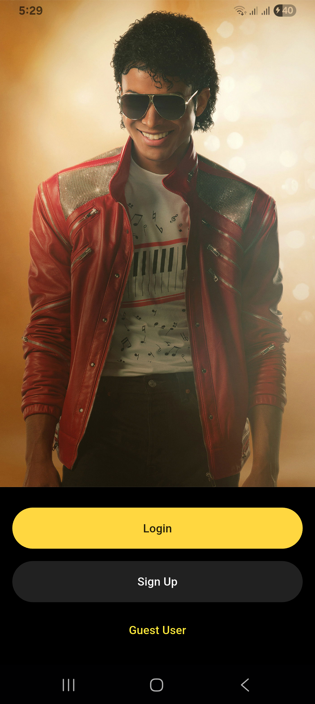
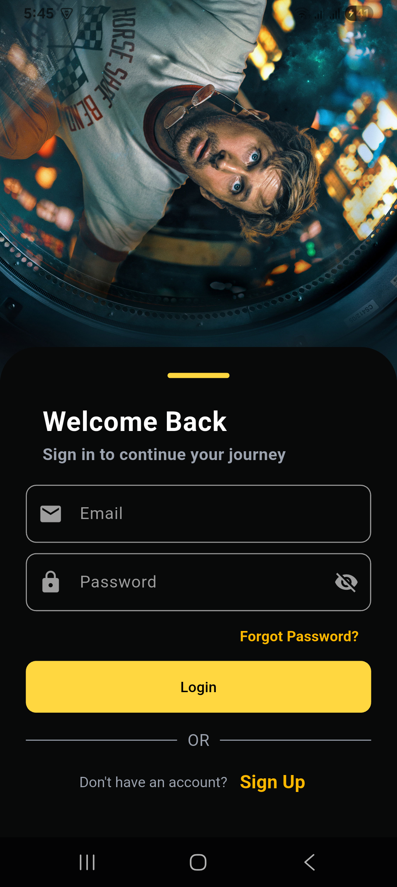
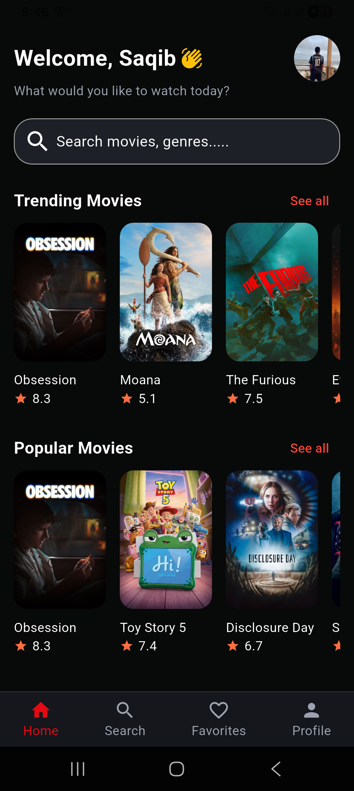
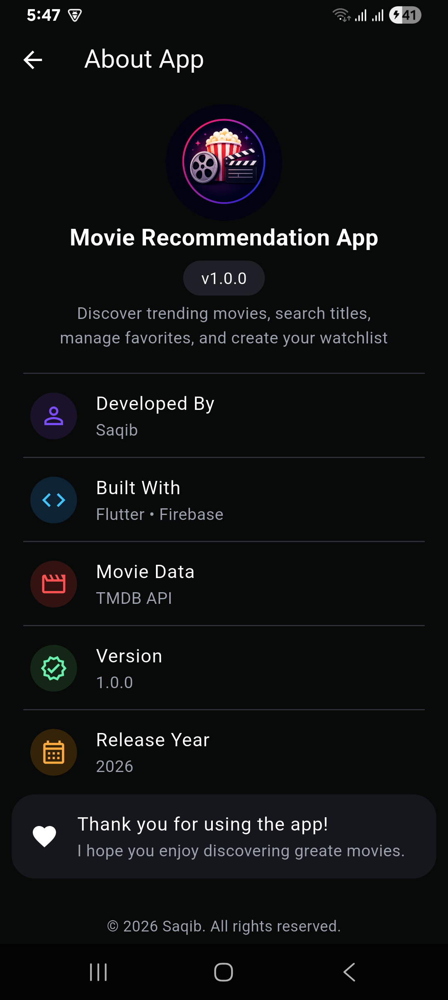

# 🎬 Movie Recommendation App

A modern and responsive **Movie Recommendation Application** built with **Flutter**, powered by **Firebase Authentication**, **Cloud Firestore**, **TMDB API**, and **Provider State Management**.

The application enables users to explore trending and popular movies, search for their favorite titles, view detailed movie information, manage favorites and watchlists, and enjoy a smooth, user-friendly experience with offline support.

---

## ✨ Features

### 🔐 Authentication
- User Registration
- Secure Login
- Guest Mode
- Password Reset
- Secure Logout
- Firebase Authentication

### 🎥 Movie Browsing
- Trending Movies
- Popular Movies
- Movies by Category
- Movie Details
- Movie Overview
- Release Date
- Runtime
- Ratings
- Genres
- Cast Information
- High Quality Posters & Backdrops

### 🔍 Search
- Real-time Movie Search
- Dynamic Search Results
- Movie Detail Navigation

### ❤️ Favorites
- Add Movies to Favorites
- Remove Movies from Favorites
- Guest Favorites Support
- Firebase Synced Favorites
- Persistent Local Storage

### 📑 Watchlist
- Add Movies to Watchlist
- Remove Movies from Watchlist
- Guest Watchlist Support
- Firebase Synced Watchlist
- Persistent Local Storage

### 👤 User Profile
- Display User Information
- Dynamic User Profile
- About App Section
- Logout

### 🎨 User Interface
- Modern Dark Theme
- Responsive Layout
- Smooth Navigation
- Bottom Navigation Bar
- Custom Widgets
- Loading Indicators
- Error Handling
- Clean UI Design

### ⚙️ State Management
- Provider Architecture
- Modular Project Structure
- Reusable Widgets
- Clean Code Organization

---

## 🛠️ Tech Stack

- Flutter
- Dart
- Firebase Authentication
- Cloud Firestore
- TMDB REST API
- Dio
- Provider
- Shared Preferences
- Connectivity Plus
- Material Design

---

## 📂 Project Structure

```text
lib/
│
├── authorization/
├── constants/
├── home/
├── models/
├── movie_details_screen/
├── provider/
├── services/
├── splash/
├── utils/
├── welcome/
├── widgets/
└── main.dart
```

---

## 🚀 Implemented Features

- ✅ Splash Screen
- ✅ Firebase Authentication
- ✅ Login & Registration
- ✅ Guest User Mode
- ✅ Password Reset
- ✅ Home Screen
- ✅ Trending Movies
- ✅ Popular Movies
- ✅ Movie Details
- ✅ Cast Information
- ✅ Search Movies
- ✅ Favorites
- ✅ Watchlist
- ✅ Profile Screen
- ✅ About App Screen
- ✅ Firebase Firestore Integration
- ✅ Responsive UI
- ✅ Provider State Management

---

## 📱 Application Screens

<p align="center">
  
  
  
  
</p>

---

## 🔑 API Configuration

This project uses the **TMDB API**.

For security reasons, the API key is **not included** in this repository.

Create the following file:

```text
lib/constants/api_constants.dart
```

using:

```text
lib/constants/api_constants.example.dart
```

Replace:

```dart
YOUR_API_KEY_HERE
```

with your own TMDB API key.

---

## 👨‍💻 Author

**Saqib**

Flutter Developer

---

## 📄 License

This project is created for learning, educational, and portfolio purposes.